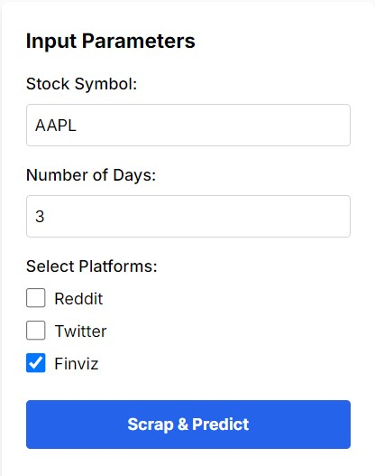
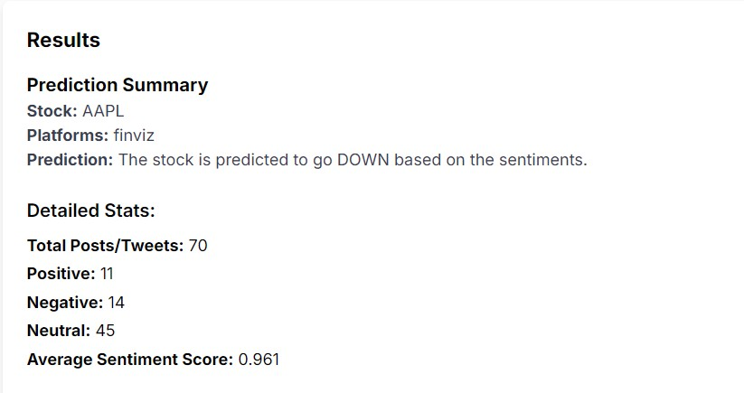
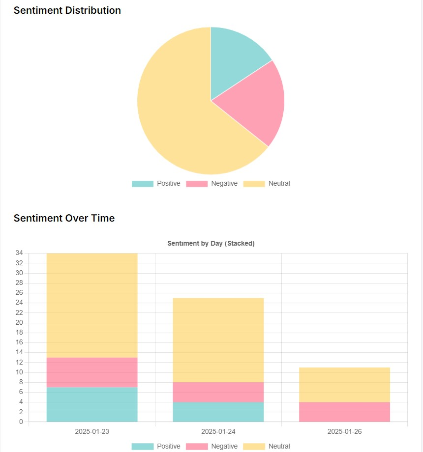

# Stock Sentiment Analysis

This project scrapes data from popular websites like **Finviz**, **Reddit**, and **Twitter** to predict the direction of stocks using **sentiment analysis** with the **FinBERT** model. The goal is to analyze sentiments expressed on these platforms to determine whether stocks are likely to go up or down.

Additionally, a **web application** built with **Next.js** allows users to input a stock ticker and the number of days for data scraping. The interface displays prediction results along with visualizations of sentiment analysis.

## Features

- Scraping stock-related data from **Reddit**, **Twitter**, and **Finviz**.
- Data preprocessing and cleaning to make it suitable for analysis.
- Sentiment analysis using the **FinBERT** model.
- Stock direction prediction based on sentiment (up, down, or neutral).
- **Web interface** built with **Next.js** where users can input stock tickers, select platforms, and view results.
- Display of detailed statistics and sentiment distribution charts.

## Technologies Used

- **Python** for backend development.
- **FastAPI** for building the API.
- **FinBERT** for sentiment analysis.
- **Uvicorn** for running the FastAPI application.
- **pandas** for data manipulation.
- **Next.js** for building the front-end web application.
- **Chart.js** or similar for visualizing data on the frontend.

## Tweet Processing

Before performing sentiment analysis, the project includes a **cleaning process** for tweets and other textual data. This cleaning process includes the following steps:

1. **Removing special characters** and unnecessary symbols.
2. **Converting text to lowercase** to ensure consistency.
3. **Removing stopwords** (e.g., "the", "and", etc.) that don’t provide useful information for sentiment analysis.
4. **Fixing typos** or variations in spelling.
5. **Removing URLs, hashtags, and mentions** that might not contribute to sentiment analysis.

This cleaning ensures that the textual data used for sentiment analysis is clean and consistent, leading to more accurate results.

## Example Usage


### User Interface

**Input Form**  
The user can enter a **stock ticker**, select the number of days for scraping, and choose the platforms (Twitter, Finviz, Reddit).  



---

**Prediction Results**  
After submission, the application displays the following predictions:  



---

**Sentiment Distribution and Charts**  
A detailed visualization of sentiment scores over time.  




## Installation

### Prerequisites

1. Clone this repository:
      ```bash
   git clone https://github.com/your-username/Stock-Sentiment-Analysis.git

2. Install Python dependencies:
      ```bash
   git clone https://github.com/your-username/Stock-Sentiment-Analysis.git
3. Install Next.js dependencies:
      ```bash
   cd frontend
   npm install

### Running the API

1. In the Server folder, run the FastAPI application:
    ```bash
   uvicorn main:app --reload

3. In the frontend folder, run the Next.js application:
   ```bash
   npm run dev

## License
This project is licensed under the MIT License - see the LICENSE file for details.

## Authors
Achraf HAJJI X Hassan EL QADI


